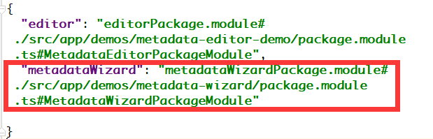

#### WebIDE插件开发指南v0.000001

1. 插件Package文件目录结构

红色框中是必需的目录及文件。

- keymaps/index.ts 定义了插件所需的快捷键...

- menus/index.ts 定义了插件所需的工具栏菜单项及右键菜单项...

- views/index.ts 定义了插件的视图类，继承自PackageView（后续会发布到npm包）。该类中需要重写serialize(); destroy();  方法...

- package.ts 定义了插件包类，继承自Package（后续会发布到npm包）。该类中重写active(state); deactive(); serialize(); 方法，也可以对组件进行操作。该类的构造函数接收一个Worksapce的实例作为参数：

  workspace提供了把插件添加到IDE界面的各种接口，以及事件通讯机制EventBus实例。

- package.module.ts 是插件的模块定义。

2. 插件注册方式(临时方案)

   因插件依赖的公共模块尚未提取npm包，插件需要先放在web-ide工程下。后续将拆出。

   修改web-ide下的webpack.config.js文件，将插件注册进来：

   

在web-ide/src/assets/config/plugins.json文件中配置插件的路径：

