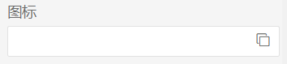
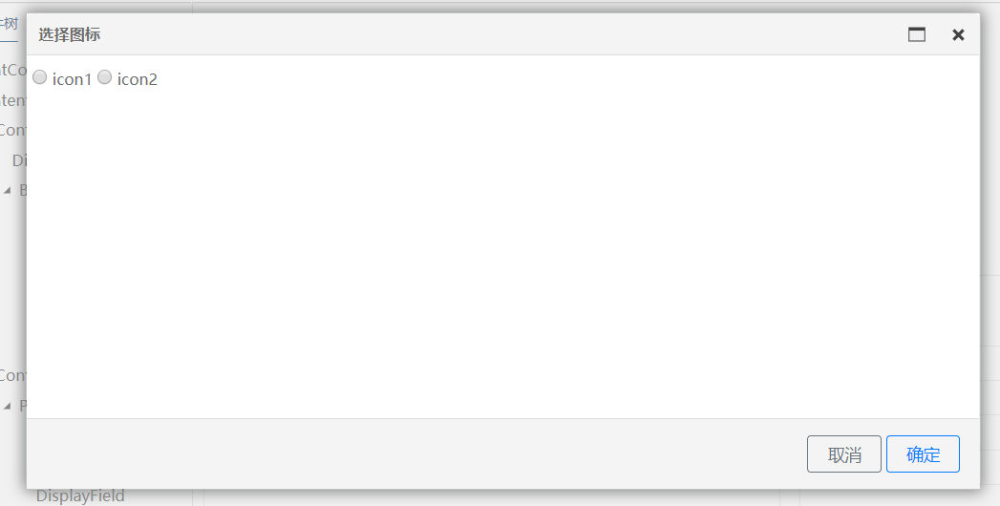

## 属性面板使用说明


在编辑器中点击某控件后，右侧需要显示控件对应的属性面板。目前已将属性面板封装为公共组件并发布NPM包，各特性模块可以直接安装引用。

1、安装：

```
npm install @farris/ide-devkit
```

2、引入模块：

```
import { PropertyPanelModule } from '@farris/ide-devkit';
@NgModule({
    imports: [
        PropertyPanelModule
    ]
})
export class FormEditorPackageModule extends PackageModule {}
```

3、引用组件：

```
<app-property-panel [(propertyConfig)]="propertyConfig" [(propertyData)]="propertyData ">
</app-property-panel>
```

组件参数如下：

| 参数           | 类型                    | 是否必填 | 说明                         |
| -------------- | ----------------------- | -------- | ---------------------------- |
| propertyConfig | ElementPropertyConfig[] | 是       | 控件需要展示或编辑的属性列表 |
| propertyData   | Object                  | 是       | 控件的属性值对象             |

若在属性面板中修改了某属性值或属性配置，propertyData和propertyConfig对象会同步修改。另外，属性面板会抛出propertyChanged事件，事件参数为变更的属性对象：

```
{
    propertyID: XXX
    propertyValue: XXX
}
```


### 配置控件属性

控件属性是指控件需要展示或编辑的属性列表，其结构必须为ElementPropertyConfig类的数组。ElementPropertyConfig描述了某一分类下的所有属性，以及属性间的关联关系：

```
export class ElementPropertyConfig {
    categoryId: string;
    categoryName: string;
    properties: PropertyEntity[];
    setPropertyRelates?(propertyID, propertyValue);
}
```

categoryId：分类ID，必须。

categoryName：分类名称，必须。

properties：属性列表，要求属性项为PropertyEntity类型，必须。

setPropertyRelates：方法，配置属性之间的关联关系，传入属性ID和属性值。可选。


**PropertyEntity：**

```
export class PropertyEntity {
    propertyID: string; // 属性ID
    propertyName: string; // 属性显示的名称
    propertyType: string; // 属性的类型
    description: string; // 属性描述
    defaultValue?: any; // 属性的默认值
    readonly = false; // 是否只读
    visible = true; // 是否可见
    iterator?: KeyMap[]; // 下拉框的枚举值
    editor?: Type<any>; // 属性自定义编辑器组件（以模态框的形式展示）
    converter?: TypeConverter; // 自定义编辑器属性值转换器
}
```

propertyType：属性在属性面板中的展示形式：

- ‘string’/'number'：普通input输入框

- 'boolean'/'select'：下拉框。其中取值为'select'时iterator为必填项，格式为KeyMap[]枚举值：

  ```
  export interface KeyMap {
      key: string;
      value: any;
  }
  ```

- 'modal'：自定义的编辑器，取值为'modal'时editor为必填项。在属性面板中显示input输入框和【更多】图标：

  

  点击图标时将动态加载editor组件并以模态框的形式展示：

  

  属性面板内部以动态创建组件的方式加载自定义编辑器，因此要求各特性模块在Metadata 对象的 entryComponents中 声明该editor。

  

### 自定义编辑器

自定义编辑器组件示例：

icon-select-editor.component.html：

```
<div>
  <input type="radio" [(ngModel)]="value" value="icon1"> icon1
  <input type="radio" [(ngModel)]="value" value="icon2"> icon2
</div>

<ng-template #iconSelectFooter>
  <div class="btns">
    <button type="button" class="btn btn-outline-secondary btn-sm px-3" (click)="clickCancel()">取消</button>
    <button type="button" class="btn btn-outline-primary btn-sm px-3" (click)="clickOK()">确定</button>
  </div>
</ng-template>
```

icon-select-editor.component.ts：

```
export class IconSelectEditorComponent {
  @Output() closeModal = new EventEmitter<any>();
  @Input() value;
  @ViewChild('iconSelectFooter') modalFooter: TemplateRef<any>;
  modalConfig = {
    title: '选择图标',
    width: 800,
    height: 400
  };
  constructor() { }

  clickOK() {
    this.closeModal.emit(this.value);
  }

  clickCancel() {
    this.closeModal.emit();
  }
}
```

输入属性value：属性值，作为组件展示数据。

输出属性closeModal事件，用于关闭模态框。若事件中包含参数，则属性面板会调用converter.convertTo方法将该值转换为String类型，用于显示在属性面板的input中。

modalConfig：定义模态框标题、宽度、高度。

modalFooter：模态框的页脚按钮，TemplateRef<any>类型，若缺省则不显示页脚。


### 自定义编辑器属性转换

自定义编辑器对应的属性值（对象）与面板input输入框（string）之间若需要进行数据转换，可以在PropertyEntity中传入converter变量，实现TypeConverter接口。

```
export interface TypeConverter {
    convertTo(data: any): string;
}
```

converTo：将编辑器中给定的值对象转换为String类型，用于显示在属性面板的input中。

